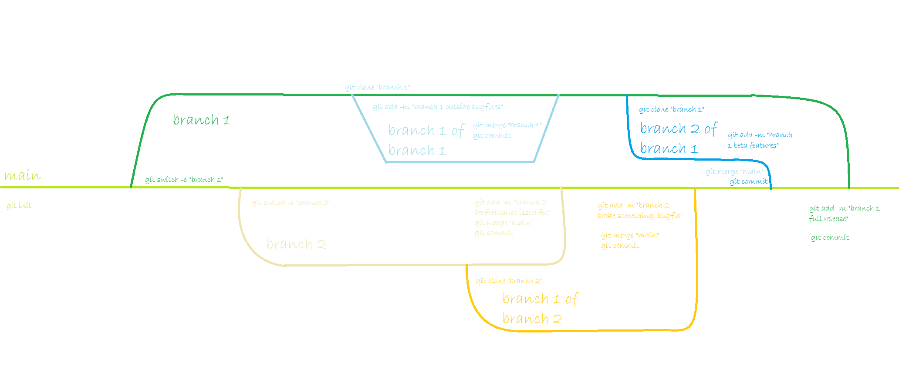

# 1.  

Versionhallinnalla pidetään kirjaa tiedostojen ja koodin muutoksista,

# 2.  

Git on ilmainen versionhallintajärjestelmä, jonka julkaisi Linus Torvalds vuonna 2005 POSIX (esim Linux) käyttöjärjestelmille. Tämän jälkeen esim. Junio Hamano ovat rakentaneet sitä eteenpäin.

# 3.  

Asenna Git ohjelma koneellesi - \>Cmd -\> cd komennolla siirry haluttuun kansioon -\> git config --global user.email "(Sähköpostiosoite)" -\> git config --global user.name "(nimi)" -\> git init -\> git add . Git commit --m "(viesti)"

# 4.  

git init, git add, git commit, git status, git clone

# 5.  

git add (tiedoston lisäys tai muutos) -\> git commit -m "(viesti muutoksista)" -\> git log

# 6.  

git restore poistaa muutokset ennen commit prosessin tekoa ja muokkaa yksittäisiä tiedostoja, git reset muuttaa paikallista commit branchia (haaraa), git revert kumoaa vanhan commitin muutokset.

# 7.  

